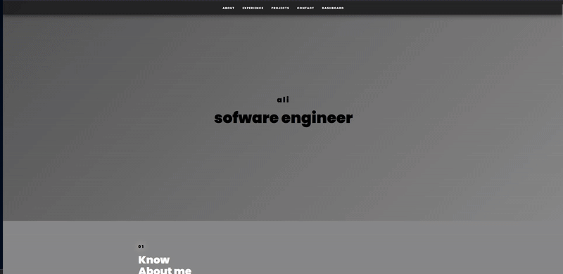

# 🖥️ Laravel Portfolio App

A clean, modular **portfolio content management system** built with **Laravel 11**.  
This application provides a structured admin dashboard to manage all key portfolio sections — including Home, About, Experience, Projects, and Contact — using modern Laravel architecture, clean code principles, and a focus on scalability and maintainability.

---

## ✨ Features
- Structured admin dashboard for content management
- CRUD functionality for portfolio sections (Home, About, Experience, Projects, Contact)
- Contact form with inbox management
- Blade-based responsive UI
- SQLite for local development, MySQL-ready for production
- Modern developer tooling:
  - 🧪 **Pest** — Elegant testing framework
  - 🧹 **Pint** — Code style formatter
  - 🪵 **Pail** — Real-time application log viewer
  - 🐳 **Sail** — Optional Docker environment

---
## 🎥 Demo



---

## 🧱 Architecture Overview
Built following **Laravel’s latest application structure** and **PSR-12 standards**, ensuring clean separation between business logic and presentation.

Key design principles:
- **Controllers** handle section logic and validation
- **Eloquent Models** map directly to database entities
- **Named Routes** provide explicit, readable API endpoints
- **Views** use Blade templates with modular components
- **Environment-driven configuration** for portability and security

---

## ⚙️ Installation

### 1️⃣ Clone & Setup
```bash
git clone https://github.com/DevAliG/laravel-portfolio-app.git
cd laravel-portfolio-app
composer install
npm install
```

### 2️⃣ Environment
```bash
cp .env.example .env
php artisan key:generate
```

### 3️⃣ Database
Default uses SQLite (auto-created).  
To use MySQL, configure in `.env`:
```
DB_CONNECTION=mysql
DB_HOST=127.0.0.1
DB_PORT=3306
DB_DATABASE=portfolio_app
DB_USERNAME=root
DB_PASSWORD=your_password
```
Then run migrations:
```bash
php artisan migrate
```

### 4️⃣ Run Locally
```bash
php artisan serve
npm run dev
```

---

## 🧪 Development Tools
```bash
php artisan test       # Run test suite (Pest)
./vendor/bin/pint      # Format code style
php artisan pail       # Stream application logs in real time
```

---

## 🚀 Roadmap
- [x] Core CRUD modules
- [x] Contact form management
- [x] Project media uploads
- [ ] Admin authentication layer
- [ ] SEO metadata controls
- [ ] Deployment on Render/AWS

---

## 🛡️ Security & Best Practices
- `.env` should never be committed to source control
- All form requests use validation and CSRF protection
- Authentication required before production deployment
- Regular code audits with **Pint** and **Pest**

---

## 👤 Author
**DevAliG (Ali Ghanbarzadeh)**  
SaaS & MVP Builder | Tech Content Creator 
[LinkedIn](https://www.linkedin.com/in/devalig) • [GitHub](https://github.com/DevAliG)

---

## 📄 License
Released under the [MIT License](LICENSE).

---
